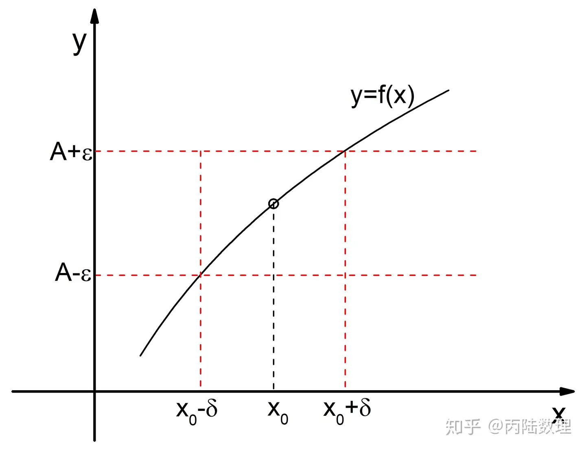

[TOC]
## 极限 [^1]
定义：设 f(x) 在点 $x_0$ 的某个<b>去心邻域</b>内有定义，如果对于任意给定的正数$\epsilon$ ，总存在一个正数$\delta$ ，使对于适合不等式 $0 < |x-x_0|<\delta$ 的一切x，对应的函数值f(x) 满足 $|f(x)-A|<\epsilon$ ，那么称常数A 为函数 f(x) 当 $x \to x_0$ 时的极限，记作$\lim\limits_{x \to x_0}f(x)=A$

极限的定义中，有几点需要注意：

第一：函数 f(x) 当 $x \to x_0$ 时的极限，是定义在$x_0$ 的某个<b>去心邻域</b>内的，并没有要求函数f(x)在$x_0$点有意义。函数f(x)当 $x \to x_0$ 时有极限时，完全可以在$x_0$点无意义。也就是说，极限不要求连续。

第二：极限的几何解释
$|f(x)-A|<\epsilon$等价于$A-\epsilon<f(x)<A+\epsilon$ 。
对于任意给定的$\epsilon>0$ ，存在$x_0$的$\delta$去心邻域，当y=f(x) 图像上的点横坐标落在$x_0$ 的$\delta$ 去心邻域内，这些点的纵坐标满足$A-\epsilon<f(x)<A+\epsilon$ 。即这些点落在下图中的红色虚线矩形框内：

可以把极限定义看成一个挑战游戏，挑战者不断给出更小的$\epsilon$值，应战者能否找到符合条件的$\delta$。

极限定义中有两个变量$\epsilon$和$\delta$。我们用笛卡尔方法来简化，先固定$\epsilon=\epsilon_0$，此时寻找满足条件的$x_0$ 的$\delta$ 去心邻域，显然$\delta$越小越容易满足。一旦找到满足条件的$\delta=\delta_0$后，再试着缩小$\epsilon=\epsilon_1(\epsilon_1<\epsilon_0)$，然后开始新一轮的$\delta$搜索，找到满足条件的$\delta=\delta_1(\delta_1<\delta_0)$。如此往复。

函数 f(x) 当 $x \to x_0$ 时存在极限，也就是说不管挑战者如何缩小$\epsilon$，总能在$x_0$的某个更小的去心邻域内满足条件。换句话说，只要去心邻域够小，函数值可以任意地逼近极限值A。

## 连续 [^2]
定义：假设函数f(x)在$x_0$的邻域U($x_0$)内是有定义的，若有函数f(x)的极限f(x)=f($x_0$)，则称函数f(x)在点$x_0$处是连续的。

从连续的定义来看，函数f(x)在一点$x_0$处连续需要同时满足3个条件，分别是：

第一：函数f(x)要在$x_0$的某邻域内是有定义的。注意不是去心邻域，而是含心领域内函数有定义。

第二：在$x_0$的去心邻域内，函数f(x)当 $x \to x_0$ 时有极限。

第三：函数f(x)当 $x \to x_0$ 时的极限等于函数值f($x_0$)，即$\lim\limits_{x \to x_0}f(x)=f(x_0)$。

根据我们在极限章节中的讨论，连续的意义是：只要$x_0$的去心邻域够小，函数值可以任意地逼近极限值$f(x_0)$。

## 可导
定义：假设函数f(x)在$x_0$的邻域U($x_0$)内是有定义的，当 $x \to x_0$ 时，表达式$\frac{f(x)- f(x_0)}{x-x_0}$的极限存在，则称f(x)在$x_0$处可导，并称这个极限为f(x)在$x_0$处的导数，记作$f'(x_0)$。
$f'(x_0) = \lim\limits_{x \to x_0}\frac{f(x)- f(x_0)}{x-x_0} = \lim\limits_{\Delta x \to 0}\frac{\Delta y}{\Delta x}$

从可导的定义中，有几点要注意：

第一：可导要求函数在$x_0$的邻域U($x_0$)内是有定义。注意不是去心邻域，而是含心领域内函数有定义。

第二：可导的几何解释。
导数是表达式$\frac{f(x)- f(x_0)}{x-x_0}$当 $x \to x_0$ 时的极限，其几何意义为函数f(x)的切线斜率。

## 可微
定义：对函数$y=f(x)$定义域中的一点$x_0$，若存在一个常数k，使得当$\Delta x \to 0$时，关系式$\Delta y = k \Delta x + o(\Delta)$恒成立，则称f(x)在$x_0$处的微分存在，或称f(x)在$x_0$处可微。并称$k\Delta x$为函数f(x)在该处的微分，记作$dy = k\Delta x$。

从可微的定义中，有几点要注意：

第一：可微要求函数在$x_0$的邻域U($x_0$)内是有定义。注意不是去心邻域，而是含心领域内函数有定义。

第二：可微的几何解释
可微定义中的关系式$\Delta y = k \Delta x + o(\Delta)$表明，一个函数在某个点上可微，意味着在该点附近存在一个线性逼近（切线），该逼近与函数的图像在该点附近很好地匹配。

## 思考
### 为什么会有可微
从可微的几何解释可知，可微就是对函数在局部作线性拟合。
究其原因，数学上线性的函数是最简单的，比较好研究。但是自然界或实际中，很多问题都是非线性的，所以需要对它们在局部进行线性化处理。在现实中，地球是球体，但是我们生活中的问题都作了线性化处理。比如，跑道长度就忽略了地球表面的曲率。
可微是一种拟合思想，它是用x的一次项拟合原函数。一次项拟合有其局限，只能在很小的局部范围内拟合原函数。
可微为拟合思想打开了大门。高等数学中拟合思想比比皆是。函数的泰勒展开就是用多项式拟合原函数，多项式中包含了x的一次，二次，...，直至n次项，这叫做n阶拟合。理论上，当n足够大时，函数的泰勒展开可以在函数的整个定义域内逼近原函数。

### 连续与可导的关系
连续不一定可导。比如，如下的分段函数是连续的，但不可导。因为左导数和右导数不相等。
$$f(x) = \begin{cases}-x & x \leqslant 0\\x & x > 0\end{cases}$$
反之，可导一定连续。从可导的定义可知：$\Delta y = f'(x_0)\Delta x + o(\Delta x)$

即有，$f(x) - f(x_0) = f'(x_0)\Delta x + o(\Delta x)$。整理后，得：

$f(x) = f(x_0) + f'(x_0)\Delta x + o(\Delta x)$

所以：$\lim\limits_{x \to x_0}f(x)=f(x_0)$。

### 可导和可微的关系
对一元函数来说，可导 和 可微 是等价的。
对多元函数来说，可微 是 可导 的充分条件。 可导 是 可微 的必要条件。
一元函数只有沿x轴方向的导数，只要可导就是可微；而多元函数有无数个方向的偏导数(或者叫方向导数)，对x和y的偏导数只是其中沿x轴和y轴方向的两个，这两个方向可偏导不代表其他方向也可以，只有⊿z-A⊿x-B⊿y是ρ的高阶无穷小(A，B分别表示两个偏导数，ρ趋向0)才代表各个方向可偏导，即可微。
一个常用的例子：
$$f(x) = \begin{cases} \frac{xy}{x^2+y^2} & x^2+y^2 \neq 0\\0 & x^2+y^2 = 0\end{cases}$$
按定义有$f_x'(0,0)=\lim\limits_{\Delta x \to 0}{\frac{f(\Delta x, 0)-f(0,0)} {\Delta x}} = \lim\limits_{\Delta x \to 0}{\frac{f(\Delta x, 0)} {\Delta x}} = \lim\limits_{\Delta x \to 0}{\frac{0} {\Delta x}} = 0 $，同理可得$f_y'(0,0)=0$。
此时，$\Delta z - dz = [f(\Delta x, \Delta y) - f(0,0)] - [f_x'(0,0) \Delta x - f_y'(0,0)\Delta y] = \frac{\Delta x \Delta y}{\Delta x^2 + \Delta y^2}$
因为$\lim\limits_{\Delta x \to 0,\Delta y \to 0}{\frac{\Delta x \Delta y}{\Delta x^2 + \Delta y^2}}$不存在，它不是ρ的高阶无穷小，故函数在（0，0）不可微。

[^1]: https://zhuanlan.zhihu.com/p/258963587

[^2]: https://baijiahao.baidu.com/s?id=1730186131081569254&wfr=spider&for=pc